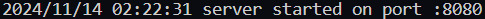

# yandex_repo

## Описание проекта
<b>Calc server</b> — это проект, написанный на языке Golang, предназначенный для вычисления арифметических выражений вида "(6+(2+2)*2)/10".

## Запуск сервера
Если вы запускаете проект на Windows вам необходимо открыть терминал, после чего указать значение переменной окружения "PORT" следующей командой: <ins><b>`$env:PORT=<порт>`</ins></b> (для linux и macOs: <ins><b>`export PORT=<порт>`</ins></b>). Для запуска сервера используйте команду <ins><b>`go run ./cmd/main.go`</b></ins>. Если порт не будет указан, то сервер будет запущен на default значении порта ":8080". Теперь сервер работает на `http://localhost:<порт>` и готов к эксплуатации.

## Обработка запросов и ошибок
При отправке правильного тела запроса, а именно application/json: `{"expression": "аримфметическое выражение верного формата"}`. Сервер будет давать текстовый ответ с статус кодом 200 ✅. 

Сервер не поддерживает никаких других видов запросов кроме POST и поэтому при попытке сделать GET, PUT и другие запросы
сервер будет выдавать ошибку "method not allowed" и статус код 405 ❌.

В случае написания неправильного тела запроса `{"expr": "2 + 2 * 2 * 3"}` 
сервер будет выводить "invalid expression" и статус код 400 ❌.

Также в коде отлавливаются различные варианты неправильного написания арифметического выражения, например, на `{"expression": "2 + 2 * (2 * 3"}` сервер будет отправлять соответствующую ошибку "mismatched parentheses", из-за того, что мы не закрыли скобку или на выражение `{"expression": "2 + 2 * 2 ^ 3"}` - "unknown operator", потому что операция возведения в степень не определена, статус код при этом равен 400 ❌. Со всеми ошибками вы можете ознакомиться в [файле с ошибками](pkg/calculation/errors.messages.go)
